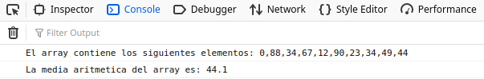
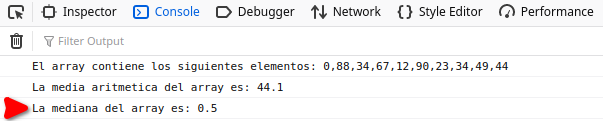

# AE1_JavaScript

Para la actividad 1 vamos a definir una array con 10 elementos numericos y vamos a tener que calcular lo siguiente:

1. La media aritmetica de los elementos del array.
2. La mediana de los elementos del array.
3. La moda de los elementos del array.

# Funcionamiento del script para calcular la media aritmetica

1. Para calcular la media aritmetica hemos empleado el metodo "reduce" que nos reduce a un solo numero el array, es decir, nos calcula la suma total de todos los numeros del array.
2. Despues el numero obtenido lo hemos dividido entre la longitud del array y de esta forma hemos obtenido la media aritmetica del array.

# Funcionamiento del script para calcular la mediana

1. Utilizando la sentencia if ... else calculamos las posiciones medias del array, primero comprobamos si la dimension del array es par o impar ya que si es par necesitamos las dos posiciones medianas del array y si es impar solo necesitamos la unica posicion mediana del array.
2. Una vez obtenidas la/las posiciones medianas, en el caso de un array de dimension par realizamos la suma de las dos posiciones medianas y la dividimos entre 2 y en el caso de tener un array de dimension impar la mediana es el valor de la unica posicion del medio del array.

# Funcionamiento del script para calcular la moda

1. Por definir.